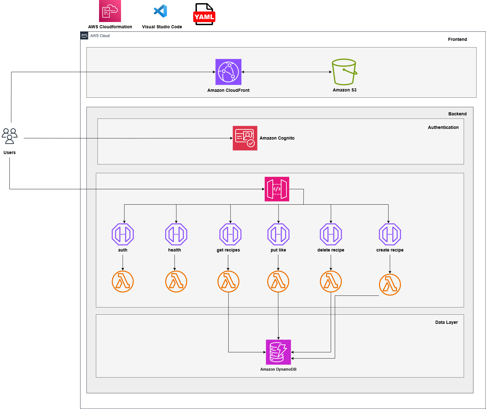

**Project: Deploy a serverless application using AWS CloudFormation**

**Overview:** This project showcases the deployment of a dynamic recipe-sharing application using AWS Lambda for serverless functionality, orchestrated through an AWS CloudFormation template.

1. **AWS CloudFormation:** 
   - Used Infrastructure as Code (IaC) with YAML templates to automate and manage AWS resource deployment.

2. **AWS S3:**
   - Created and managed an S3 bucket to securely store application files.

3. **AWS CloudFront:**
   - Configured a content delivery network (CDN) to efficiently distribute web content to users globally.

4. **AWS DynamoDB:**
   - Implemented a NoSQL database to store recipes as document-based items, ensuring high performance and flexibility.

5. **AWS CloudFormation:**
   - Utilized Infrastructure as Code (IaC) with YAML templates to automate and manage AWS resource deployment.

6. **AWS Cognito:**
   - Managed user authentication and access for the web application.

7. **AWS Lambda:**
   - Developed serverless functions, allowing AWS to handle provisioning and compute resource management.

8. **AWS API Gateway:**
   - Configured API endpoints to manage and expose application services.

**Repository**: The reference diagram and YAML file for this project are available in the GitHub repository. Please refer to the repository for detailed instructions on deploying the stack.

**Conclusion**: By deploying the YAML template, you can successfully launch a serverless application.
